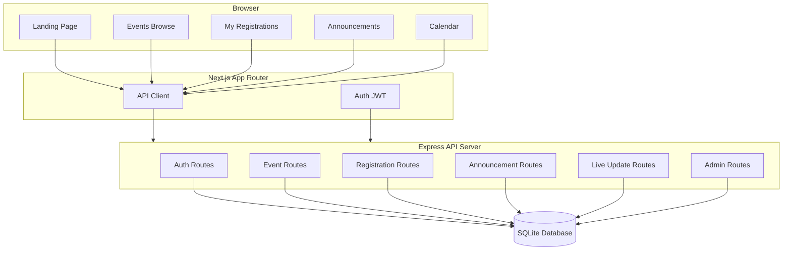
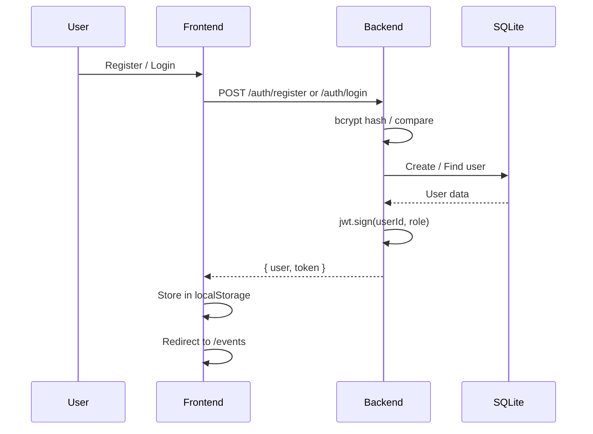
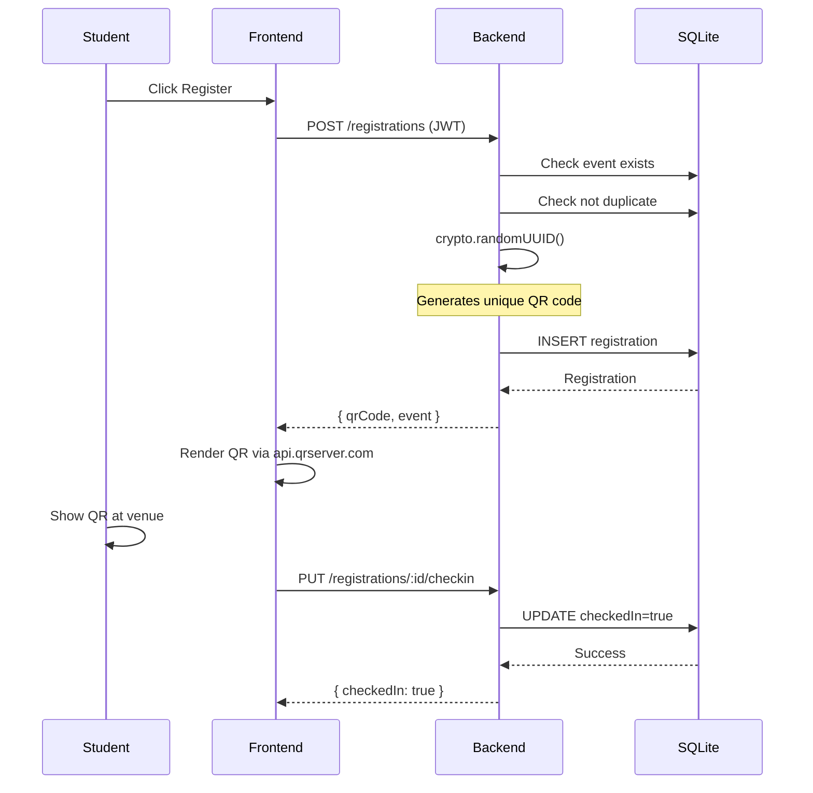
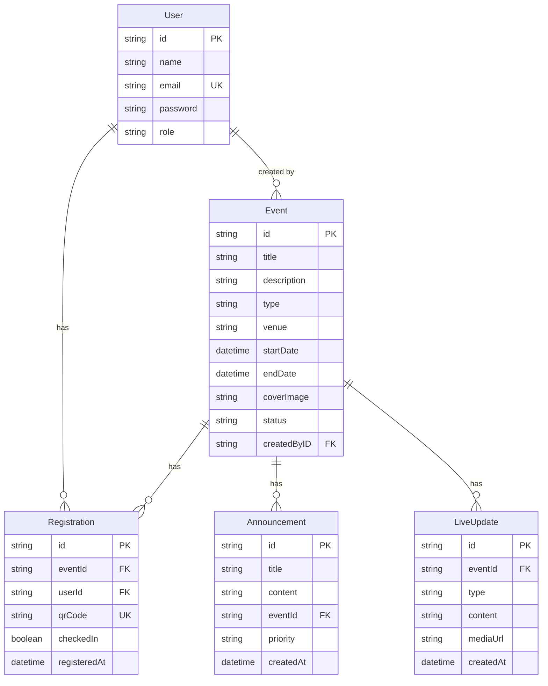

# EventX

> The unified command center for school events. From debates to cultural fests — schedules, registrations, announcements, live updates, calendar, and admin panel under one roof.

Built with **Next.js 16**, **Express 5**, **Prisma**, **SQLite**, and **framer-motion**.

---

## Architecture



### Data Flow — Auth



### Data Flow — Registration



---

## Tech Stack

| Layer     | Tech                                              |
| --------- | ------------------------------------------------- |
| Frontend  | Next.js 16, React 19, TypeScript 6                |
| Animations| framer-motion 12 (`motion`)                       |
| Styling   | Inline styles + `<style>` blocks, CSS custom props|
| Backend   | Express 5, TypeScript 6                           |
| Database  | SQLite via Prisma ORM                             |
| Auth      | bcryptjs + jsonwebtoken                           |
| QR Codes  | crypto.randomUUID() + api.qrserver.com            |
| Font      | Outfit (Google Fonts)                             |

---

## Database Schema



---

##  API Reference

Base: `http://localhost:5000/api` (dev) or `http://176.100.36.169:4001/api` (production)

Standard response:
```json
{ "success": true, "data": { ... }, "message": "..." }
{ "success": false, "error": "..." }
```

### Auth

| Method | Endpoint         | Auth   | Description       |
| ------ | ---------------- | ------ | ----------------- |
| POST   | `/auth/register` | No     | Create account    |
| POST   | `/auth/login`    | No     | Sign in           |
| GET    | `/auth/me`       | Bearer | Get current user  |

### Events

| Method | Endpoint      | Auth          | Description     |
| ------ | ------------- | ------------- | --------------- |
| GET    | `/events`     | No            | List events     |
| GET    | `/events/:id` | No            | Event details   |
| POST   | `/events`     | Admin/Teacher | Create event    |
| PUT    | `/events/:id` | Admin/Teacher | Update event    |
| DELETE | `/events/:id` | Admin         | Delete event    |

`GET /events` query params: `type`, `status`, `search`

### Registrations

| Method | Endpoint                     | Auth   | Description          |
| ------ | ---------------------------- | ------ | -------------------- |
| POST   | `/registrations`             | Bearer | Register for event   |
| GET    | `/registrations/mine`        | Bearer | My registrations     |
| PUT    | `/registrations/:id/checkin` | Bearer | Check-in (scan QR)   |

### Announcements

| Method | Endpoint                    | Auth          | Description         |
| ------ | --------------------------- | ------------- | ------------------- |
| GET    | `/announcements`            | No            | List announcements  |
| GET    | `/announcements/event/:id`  | No            | By event            |
| POST   | `/announcements`            | Admin/Teacher | Create announcement |
| DELETE | `/announcements/:id`        | Admin         | Delete              |

`GET /announcements` query param: `priority` (`low`, `medium`, `high`, `urgent`)

### Live Updates

| Method | Endpoint                  | Auth          | Description      |
| ------ | ------------------------- | ------------- | ---------------- |
| GET    | `/live-updates/event/:id` | No            | By event         |
| POST   | `/live-updates`           | Admin/Teacher | Create update    |
| DELETE | `/live-updates/:id`       | Admin         | Delete           |

### Admin

| Method | Endpoint                          | Auth  | Description                |
| ------ | --------------------------------- | ----- | -------------------------- |
| GET    | `/admin/stats`                    | Admin | Dashboard stats            |
| GET    | `/admin/events`                   | Admin | All events with counts     |
| GET    | `/admin/users`                    | Admin | All users with stats       |
| PUT    | `/admin/users/:id`                | Admin | Update user (role)         |
| DELETE | `/admin/users/:id`                | Admin | Delete user (cascade)      |
| GET    | `/admin/registrations`            | Admin | All registrations          |
| PUT    | `/admin/registrations/:id/checkin`| Admin | Manual check-in            |
| GET    | `/admin/live-updates`             | Admin | All live updates           |
| DELETE | `/admin/live-updates/:id`         | Admin | Delete update              |

---

## Frontend Routes

### Public

| Route               | Description                                  |
| ------------------- | -------------------------------------------- |
| `/`                 | Landing page (hero, features, stats, CTA)    |
| `/login`            | Sign in (no header/footer)                   |
| `/register`         | Create account (no header/footer)            |
| `/events`           | Browse events with search, type/status filters, countdowns on cards |
| `/events/[id]`      | Event detail — hero, countdown, description, sidebar, registration, announcements, live updates, share button |
| `/announcements`    | Priority-filtered announcements list         |
| `/calendar`         | Month grid calendar with event dots, day panel with countdowns |
| `/my-registrations` | Dashboard with QR tickets, check-in status, share button |

### Admin (`/admin`)

| Route                          | Description                              |
| ------------------------------ | ---------------------------------------- |
| `/admin`                       | Dashboard — stat cards, recent registrations, quick actions |
| `/admin/events`                | Events table — search, filters, edit/delete |
| `/admin/events/new`            | Create event form                        |
| `/admin/events/[id]/edit`      | Edit / delete event                      |
| `/admin/announcements/new`     | Post announcement with priority + event  |
| `/admin/checkin`               | QR code text input, attendee lookup      |
| `/admin/registrations`         | Registrations table with manual check-in |
| `/admin/users`                 | Users table with inline role change, delete |
| `/admin/live-updates`          | Create / list / delete live updates      |

---

## How It Works

### For Students
1. **Browse** — Visit `/events` or `/calendar` to see everything happening. Countdowns show time remaining for upcoming events.
2. **Register** — Click any event, hit "Register for this event", get an instant QR ticket.
3. **Attend** — Show your QR code at the door. Organizers scan it for check-in.
4. **Stay updated** — Announcements and live updates appear right on the event page.
5. **Share** — Share event links with friends via native share or clipboard copy.

### For Teachers/Admins
1. **Create events** via the admin panel — full form with dates, venue, type, cover image.
2. **Push announcements** — Tag them with priority levels. Urgent ones pop in red.
3. **Check in attendees** — QR text input, one-click verification.
4. **Manage users** — Change roles, remove accounts (cascade deletes their data).
5. **Post live updates** — Real-time event updates with type badges.
6. **Dashboard** — Overview stats, recent registrations, quick actions grid.

### For Parents
1. **Track registrations** — See what your child has signed up for.
2. **Get announcements** — Priority-filtered view of all school communications.
3. **Calendar view** — See all events laid out by month.

---

## Admin Panel

The admin panel uses a **collapsible sidebar layout**:
- **Expanded** — 240px wide with nav labels and user info
- **Collapsed** — 64px icon-only, saves vertical space
- **Mobile** — FAB button opens a full-screen overlay sidebar
- All admin routes are protected — non-authenticated users are redirected to `/login`
- Non-admin users see an "Access denied" message

The sidebar provides one-click access to: Dashboard, Events, Announcements, Check-in, Registrations, Users, and Live Updates.

---

## Design

- **No Tailwind** — all styles are inline objects + `<style>` blocks with CSS custom properties.
- **Monochrome** — grayscale palette (`--gray-50` through `--gray-950`) with pure black and white.
- **Animations** — framer-motion for reveals, staggers, page transitions, and micro-interactions.
- **Lazy loading** — landing page sections are `lazy()` loaded for fast initial paint.
- **Responsive** — mobile hamburger menu, fluid typography (`clamp()`), adaptive grids.
- **Auth-aware** — Header/Footer hidden on auth pages (`(auth)` route group) and admin pages.
- **Custom Select** — portal-rendered dropdown via `createPortal`, never clipped by overflow containers.

---

## Deployment

```bash
git pull
./run.sh full     # First time: install → generate → push → seed → build → start
./run.sh update   # After pulls: generate → push → build → start
./run.sh seed     # Re-seed the database
./run.sh dev      # Dev mode with nodemon
```

**Fresh setup:**
```bash
git pull
./start.sh        # npm install → clean DB → re-push schema → seed → build → start
```

**Clean reset:**
```bash
./clean.sh        # Deletes prisma/dev.db + re-pushes schema
```

Backend: `http://176.100.36.169:4001`
Frontend: built locally (`npm run build`), deployed as Next.js standalone

---

## Project Structure

```
EventX/
├── backend/
│   ├── prisma/
│   │   ├── schema.prisma    # User, Event, Registration, Announcement, LiveUpdate
│   │   ├── seed.ts          # 3 users, 6 events, 5 announcements, 4 live updates
│   │   └── dev.db           # SQLite file (gitignored)
│   ├── src/
│   │   ├── app.ts           # Express server entry
│   │   ├── config/env.ts    # Environment config
│   │   ├── controllers/
│   │   │   ├── auth.controller.ts
│   │   │   ├── event.controller.ts
│   │   │   ├── registration.controller.ts
│   │   │   ├── announcement.controller.ts
│   │   │   ├── live-update.controller.ts
│   │   │   └── admin.controller.ts   # Stats, users, all CRUD
│   │   ├── lib/prisma.ts     # Prisma client singleton
│   │   ├── middlewares/
│   │   │   ├── auth.middleware.ts     # JWT verification
│   │   │   └── error.middleware.ts    # Global error handler
│   │   ├── routes/
│   │   │   ├── auth.routes.ts
│   │   │   ├── event.routes.ts
│   │   │   ├── registration.routes.ts
│   │   │   ├── announcement.routes.ts
│   │   │   ├── live-update.routes.ts
│   │   │   └── admin.routes.ts
│   │   └── utils/response.ts
│   ├── run.sh               # Deploy script (full/update/seed/dev)
│   ├── clean.sh             # Delete DB + re-push schema
│   ├── start.sh             # Full fresh setup
│   ├── tsconfig.json
│   └── tsconfig.seed.json
├── frontend/
│   ├── src/
│   │   ├── app/
│   │   │   ├── (auth)/      # Login & register (no chrome)
│   │   │   ├── admin/       # Collapsible sidebar layout + all admin pages
│   │   │   ├── events/      # Browse & detail + countdowns
│   │   │   ├── announcements/
│   │   │   ├── calendar/    # Month grid + day panel
│   │   │   ├── my-registrations/
│   │   │   ├── layout.tsx   # Root layout (Outfit font)
│   │   │   ├── auth-aware-layout.tsx  # Conditional Header/Footer
│   │   │   ├── page.tsx     # Landing page
│   │   │   └── not-found.tsx
│   │   ├── components/
│   │   │   ├── landing/     # Hero, Features, HowItWorks, StatsTicker, CTA
│   │   │   ├── layout/      # Header (scroll blur, mobile menu), Footer (minimal)
│   │   │   └── ui/          # Reveal, StaggerContainer, Shimmer, PageTransition, FloatingOrbs, ParticleSphere, Countdown, Select
│   │   ├── hooks/useAuth.ts
│   │   ├── lib/
│   │   │   ├── api-client.ts      # Fetch wrapper with JWT, URLSearchParams
│   │   │   └── utils.ts           # Date formatters
│   │   ├── services/
│   │   │   ├── auth.service.ts
│   │   │   ├── event.service.ts
│   │   │   ├── registration.service.ts
│   │   │   ├── announcement.service.ts
│   │   │   ├── live-update.service.ts
│   │   │   └── admin.service.ts
│   │   └── types/index.ts
│   ├── next.config.ts
│   └── package.json
├── .gitignore
└── README.md
```

---

## Key UI Components

| Component       | File                                           | Description                                    |
| --------------- | ---------------------------------------------- | ---------------------------------------------- |
| Countdown       | `components/ui/countdown.tsx`                   | Live days/hrs/min/sec, 1s tick, 3 sizes        |
| Select          | `components/ui/select.tsx`                      | createPortal dropdown, fixed positioning        |
| Reveal          | `components/ui/reveal.tsx`                      | Scroll-triggered fade-in animation              |
| StaggerContainer| `components/ui/stagger-container.tsx`           | Staggered children reveal                       |
| Shimmer         | `components/ui/shimmer.tsx`                     | Loading skeleton animation                      |
| FloatingOrbs    | `components/ui/floating-orbs.tsx`               | Ambient landing page decoration                 |
| ParticleSphere  | `components/ui/particle-sphere.tsx`             | Animated particle sphere                        |

---

## Environment Variables

### Backend (`backend/.env`)
```
PORT=5000
JWT_SECRET=your-secret-here
DATABASE_URL="file:./prisma/dev.db"
CORS_ORIGIN=http://localhost:3000
```

### Frontend (`frontend/.env.local`)
```
NEXT_PUBLIC_API_URL=http://localhost:5000/api
```

Both files are gitignored.
